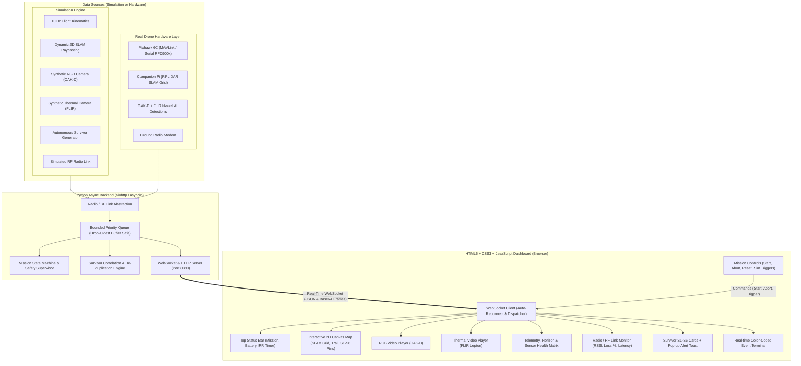

# NIDAR AirMouse Ground Control Station (GCS)

**Track 1 – Mission 2 (AIR Mouse) Autonomous Indoor Search, Mapping & Survivor Localisation System**

---

## 1. System Overview & Architecture

The **NIDAR AirMouse GCS** is a professional desktop Ground Control Station engineered for Windows using a **Python 3.11+ asynchronous backend (`aiohttp`)**, **real-time WebSockets**, and an **HTML5 + CSS3 + JavaScript Dashboard**.



---

## 2. Directory Structure

```
NIDAR_AIRMOUSE_GCS/
│
├── main.py                          # Unified application launcher (starts backend & opens browser)
├── requirements.txt                 # Dependencies (aiohttp, opencv-python, numpy, pymavlink, pytest)
├── README.md                        # Documentation & setup manual
│
├── backend/
│   ├── schemas.py                   # Standard JSON message definitions
│   ├── message_queue.py             # Bounded priority queue & drop-oldest buffer management
│   ├── radio_manager.py             # RF Radio communication layer abstraction
│   ├── survivor_engine.py           # Autonomous survivor de-duplication & multimodal correlation
│   └── server.py                    # aiohttp async web & WebSocket server
│
├── frontend/
│   ├── index.html                   # GCS Dashboard HTML5 structure
│   ├── css/
│   │   └── styles.css               # Dark tactical aeronautical stylesheet
│   └── js/
│       ├── app.js                   # Master application coordinator
│       ├── ws_client.js             # Robust WebSocket client with auto-reconnect
│       ├── map_renderer.js          # Interactive 2D Canvas dynamic SLAM map renderer
│       ├── telemetry_view.js        # Telemetry metrics & Canvas artificial horizon
│       ├── camera_view.js           # Dual video stream renderers (RGB & Thermal)
│       ├── survivor_manager.js      # S01-S06 cards & non-blocking toast pop-up alerts
│       ├── radio_view.js            # RF radio link diagnostics monitor
│       ├── event_log.js             # Real-time scrolling system event terminal
│       └── controls.js              # Mission action buttons & abort confirmation modal
│
├── config/
│   ├── config.json                  # Ports, grid size (20m x 20m), safety limits
│   └── config_manager.py            # Typed dataclass config loader
│
├── simulation/
│   ├── simulated_telemetry.py       # 10 Hz flight dynamics simulator
│   ├── simulated_map.py             # 2D dynamic SLAM raycasting simulator
│   ├── simulated_survivors.py       # Simulated autonomous survivor targets
│   └── simulated_video.py           # Dual RGB (OAK-D) & Thermal (FLIR) synthetic stream generator
│
└── tests/
    ├── test_backend_server.py       # Server & WebSocket tests
    ├── test_buffer_stress.py        # High-traffic stress test verifying zero buffer errors
    ├── test_message_queue.py        # Priority & drop-oldest queue tests
    ├── test_radio_manager.py        # RF radio link tests
    ├── test_survivor_engine.py      # Survivor localization tests
    ├── test_grid_manager.py         # Search grid coordinate conversion tests
    └── test_safety_manager.py       # Safety alert tests
```

---

## 3. Installation & Quick Start (Windows)

### Step 1: Open PowerShell
```powershell
cd e:\nidar\NIDAR_AIRMOUSE_GCS
```

### Step 2: (Optional) Activate Virtual Environment
```powershell
.\venv\Scripts\Activate.ps1
```

### Step 3: Install Dependencies
```powershell
pip install -r requirements.txt
```

### Step 4: Run Automated Tests
```powershell
pytest tests/
```

### Step 5: Launch the GCS
```powershell
python main.py
```
*The GCS backend starts on `http://127.0.0.1:8080` and opens your default web browser.*

---

## 4. How to Test Simulation Mode

1. **Launch App**: Run `python main.py`. The dark dashboard opens in your browser.
2. **Connect**: Click the **CONNECT** button in the header bar.
   - Status switches to **CONNECTED**.
   - RF Radio link initializes (`RSSI: -64 dBm | Signal: GOOD`).
   - Mission state executes a 1-second `SYSTEM_CHECK` and transitions to `READY`.
   - Dual 12 FPS streams begin streaming: **RGB Camera (OAK-D)** and **Thermal Camera (FLIR)**.
3. **Commence Mission**: Click **▶ START MISSION**.
   - Drone climbs to 1.25m (`TAKEOFF`) and enters the search arena (`ENTERING` $\to$ `EXPLORING`).
   - 2D Occupancy Grid map dynamically reveals corridors and walls in cyan/white.
   - Drone marker navigates waypoints while leaving a persistent breadcrumb trail.
4. **Survivor Discovery & Pop-ups**:
   - At ~15 seconds, **Survivor S01** is detected at Grid `B3` (95% confidence).
   - A non-blocking toast notification slides in at the top right: `🚨 AUTONOMOUS SURVIVOR DETECTED: S01 | Grid: B3 | Conf: 95% | Src: THERMAL`.
   - The S01 card turns green and an S01 pin is placed on the 2D map.
   - At ~45 seconds, **Survivor S02** is detected at Grid `F5` (92% confidence).
5. **Interactive 2D Map Controls**:
   - Pan by dragging the mouse across the map canvas.
   - Zoom using the mouse scroll wheel or `➕` / `➖` buttons.
   - Click `Fit Map` to auto-center the arena.
   - Click any survivor card to focus the map directly onto that survivor.
6. **Emergency Abort**:
   - Click **🛑 EMERGENCY ABORT**. A confirmation modal appears. Confirming halts navigation and transitions to `ABORTED`.
