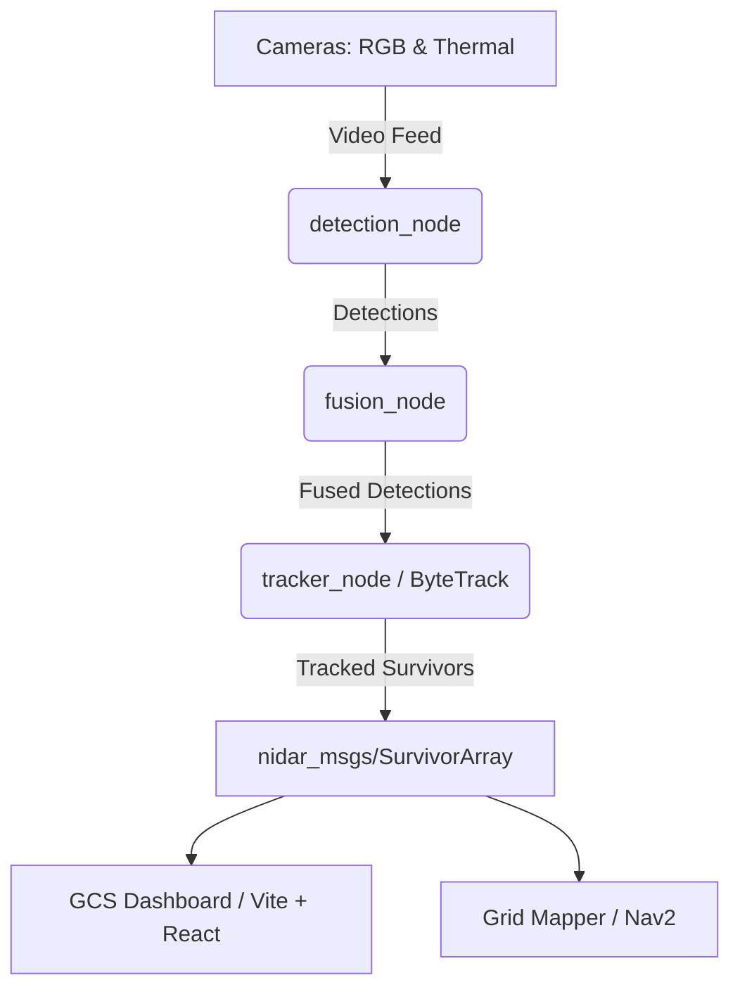

# NIDAR AirMouse 🛩️🎯

**NIDAR AirMouse** is a search-and-rescue payload system deployed on drones (specifically targeting the Raspberry Pi 4 ARM64 platform) to perform real-time survivor detection and tracking. By integrating computer vision (YOLOv8/11), multi-object tracking (ByteTrack), and sensor fusion (RGB + Thermal), it identifies survivors and reports their positions to a Ground Control Station (GCS).

---

## 🏗️ System Architecture

The NIDAR system is organized as a ROS 2 workspace orchestrating several modular components:



### Key Modules

1. **`detection_node`**: Deep learning pipeline utilizing **YOLOv8** / **YOLO11** to detect human presence in webcam, OAK-D, or FLIR thermal feeds. Supports offline training pipelines and custom weight management.
2. **`tracker_node`**: Multi-object tracking node powered by Ultralytics **ByteTrack** (`BYTETracker`). Maintains tracking IDs, calculates velocities, and handles temporary occlusions for survivors.
3. **`nidar_msgs`**: Custom ROS 2 interfaces defining messages for communication:
   - `SurvivorDetection.msg`: 3D position, confidence, source (RGB/Thermal/Fused), bbox, and tracking status.
   - `SurvivorArray.msg`: Array of current survivor detections.
   - `SpaceClassification.msg`: For classifying operational environments.
   - `MissionStatus.msg`: System diagnostic and drone mission status.
4. **`nidar_gcs`**: Ground Control Station web application powered by **Vite + React** and `roslibjs` to visualize the drone's path, telemetry, and detected survivors on a map.

---

## 📂 Project Structure

```text
nidar-air_mouse/
├── Dockerfile                 # Multi-stage ARM64 Dockerfile for Raspberry Pi 4 (ROS Humble)
├── docker-compose.yml         # Dev services for ROS 2 nodes and GCS frontend
├── docker-entrypoint.sh       # Automatically sources ROS 2 and workspace setup files
├── .env.example               # Example configurations (ports, domain IDs, FCU URLs)
└── src/
    ├── backend/
    │   ├── requirements.txt   # Python requirements (PyTorch, Ultralytics, OpenCV, etc.)
    │   ├── detection_node/    # Human detection scripts, YOLO weights, and training datasets
    │   ├── tracker_node/      # ByteTrack integration ROS 2 package
    │   └── nidar_msgs/        # Custom ROS 2 message definitions
    └── frontend/              # GCS React dashboard (mounted to nidar_gcs)
```

---

## 🔌 Hardware & Targets

* **Compute**: Raspberry Pi 4 (ARM64) running Ubuntu Server 22.04 LTS.
* **Flight Controller**: Pixhawk 6C connected via serial (`/dev/ttyACM0`) using MAVROS.
* **Lidar**: RPLIDAR A2M8 (`/dev/ttyUSB0`) for mapping and navigation.
* **Thermal Imaging**: FLIR Lepton 3.5 via PureThermal board (`/dev/video0`).
* **RGB-D Sensing**: OAK-D camera via USB bulk transfer.

---

## 🚀 Quick Start

Ensure you have [Docker](https://docs.docker.com/get-docker/) and [Docker Compose](https://docs.docker.com/compose/install/) installed.

### 1. Configuration
Copy the template configuration file:
```bash
cp .env.example .env
```
Adjust environment variables such as `ROS_DOMAIN_ID` and the device paths (`MAVROS_FCU_URL`, `RPLIDAR_PORT`, `FLIR_DEVICE`) based on your hardware configuration.

### 2. Deploy Services
To compile the workspace and launch all services:
```bash
docker compose up --build
```
This builds and starts:
- **`nidar_ros`**: Builds custom messages (`nidar_msgs`), tracker, and launches the ROS 2 bringup routine.
- **`nidar_gcs`**: Serves the web dashboard on [http://localhost:3000](http://localhost:3000).

---

## 🛠️ Development Workflow

To manually build or run tests within the Docker container:

### Enter the ROS container
```bash
docker exec -it nidar_ros bash
```

### Build the Workspace
Inside the container, run:
```bash
colcon build --symlink-install
source install/setup.bash
```

### Run Tests
```bash
colcon test --packages-select tracker_node
colcon test-result --all
```

---

## ⚙️ Middleware Settings

* **DDS Client**: By default, this workspace uses **Cyclone DDS** (`rmw_cyclonedds_cpp`) instead of FastDDS, which provides better stability on Raspberry Pi 4 and inside Docker network bridges.
* **ROS Domain ID**: Controlled via `ROS_DOMAIN_ID` (default: `0`) to isolate DDS discovery from other devices on the same network.
