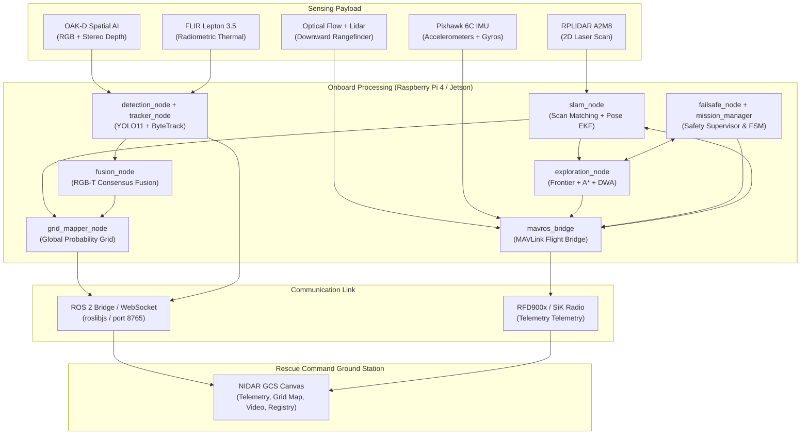
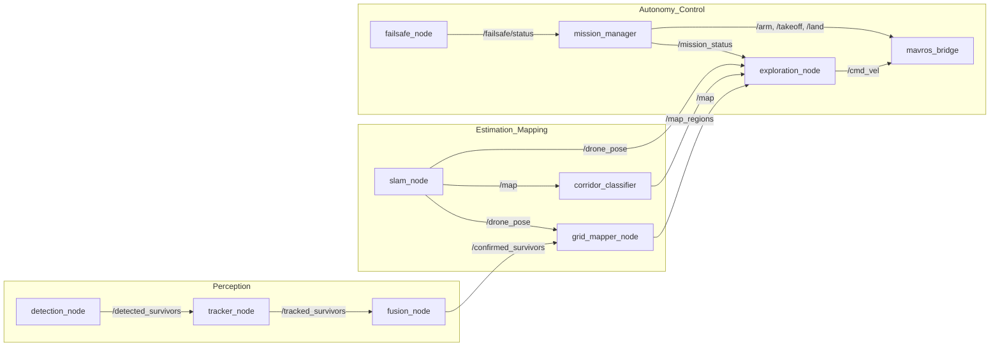
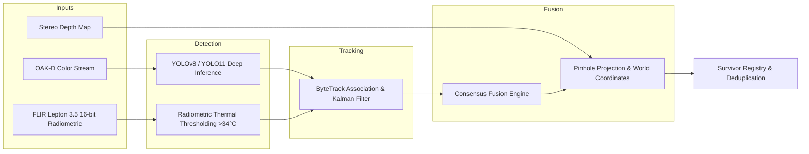
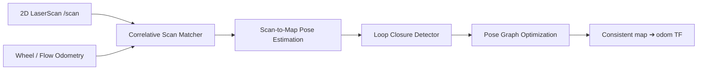
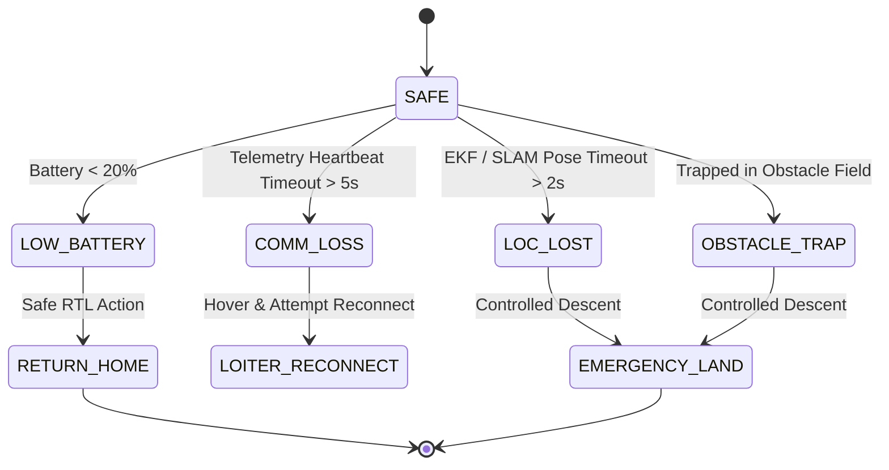

# NIDAR AirMouse / NIDAR M2 Search-and-Rescue UAV 🛩️🎯

[](https://docs.ros.org/en/humble/)
[](https://www.python.org/)
[](https://opensource.org/licenses/MIT)
[]()
[]()

Autonomous GPS-denied search-and-rescue UAV operating inside earthquake-damaged, collapsed-structure, and subterranean environments. Powered by 2D LiDAR SLAM, frontier-based autonomous exploration, DWA local planning, dual-spectrum RGB + thermal human detection (YOLOv8/11 + Radiometric Thermal blob detection), consensus fusion, 3D survivor localization, and a high-reliability Ground Control Station (GCS).

---

## 📑 Table of Contents

1. [Problem Statement](#1-problem-statement)
2. [Mission Objectives](#2-mission-objectives)
3. [System Architecture](#3-system-architecture)
4. [Software Architecture](#4-software-architecture)
5. [ROS 2 Node Architecture](#5-ros-2-node-architecture)
6. [AI Pipeline](#6-ai-pipeline)
7. [GPS-Denied Localization](#7-gps-denied-localization)
8. [SLAM](#8-slam)
9. [Mapping](#9-mapping)
10. [Autonomous Exploration](#10-autonomous-exploration)
11. [Navigation & Obstacle Avoidance](#11-navigation--obstacle-avoidance)
12. [Survivor Detection](#12-survivor-detection)
13. [Survivor Localization & Deduplication](#13-survivor-localization--deduplication)
14. [Telemetry & Communication](#14-telemetry--communication)
15. [Failsafe & Safety Supervisor](#15-failsafe--safety-supervisor)
16. [Ground Control Station (GCS)](#16-ground-control-station-gcs)
17. [Docker Deployment](#17-docker-deployment)
18. [Hardware & Software Requirements](#18-hardware--software-requirements)
19. [Installation & Setup](#19-installation--setup)
20. [Running the System](#20-running-the-system)
21. [SITL Simulation Testing](#21-sitl-simulation-testing)
22. [Hardware Testing Protocols](#22-hardware-testing-protocols)
23. [Test Results](#23-test-results)
24. [Current Completion Status](#24-current-completion-status)
25. [Known Limitations](#25-known-limitations)
26. [Future Work](#26-future-work)

---

## 1. Problem Statement

During catastrophic earthquakes, industrial collapses, and indoor disasters, search-and-rescue (SAR) teams face severely degraded and dangerous environments:
- **GPS Denial**: Concrete, rebar, subterranean levels, and dense ruins attenuate and reflect GNSS signals completely.
- **Zero Visibility & Dust**: Particulate matter, smoke, and blackout conditions blind standard optical vision.
- **Structural Collapses**: Cluttered, non-Euclidean corridors and unstable obstacles require real-time mapping and obstacle avoidance.
- **Human Locatability**: Trapped victims must be detected reliably across thermal and optical spectra, localized in 3D world coordinates, deduplicated, and mapped to precise rescue grid cells without human operator intervention.

---

## 2. Mission Objectives

1. **Autonomous GPS-Denied Flight**: Maintain stable altitude and metric position hold inside enclosed corridors using fused IMU, optical flow, downward rangefinder, and 2D LiDAR.
2. **Real-Time SLAM & Occupancy Mapping**: Generate 5 cm/pixel probabilistic 2D occupancy grids while estimating drone trajectory and loop closures.
3. **Frontier-Based Autonomous Exploration**: Dissect unknown arena frontiers, evaluate information-gain vs. travel-cost metrics, and navigate corridors without human piloting.
4. **Dual-Spectrum Survivor Detection & Tracking**: Detect human targets simultaneously with YOLOv8/11 and radiometric thermal thresholding; track survivor IDs persistently through temporary occlusions with ByteTrack.
5. **3D Metric Survivor Localization**: Project pixel detections through camera intrinsic models and depth measurements into world map coordinates $(x, y, z)$.
6. **Telemetry & Rescue Dashboard**: Relay telemetry, mapped occupancy grids, detected survivors, and sensor health metrics over RFD900x / WebSocket telemetry links to the GCS dashboard.
7. **Autonomous Return & Safe Land**: Trigger deterministic failsafe reactions (low battery, localization failure, communication loss, obstacle trap).

---

## 3. System Architecture

The NIDAR system integrates aerial hardware, onboard compute, ROS 2 middleware, and GCS telemetry:


```mermaid
graph TD
    subgraph SENSORS ["Sensing Payload"]
        LIDAR["RPLIDAR A2M8<br/>(2D Laser Scan)"]
        OAK["OAK-D Spatial AI<br/>(RGB + Stereo Depth)"]
        THERMAL["FLIR Lepton 3.5<br/>(Radiometric Thermal)"]
        OPTICAL["Optical Flow + Lidar<br/>(Downward Rangefinder)"]
        IMU["Pixhawk 6C IMU<br/>(Accelerometers + Gyros)"]
    end

    subgraph ONBOARD ["Onboard Processing (Raspberry Pi 4 / Jetson)"]
        MAVROS["mavros_bridge<br/>(MAVLink Flight Bridge)"]
        SLAM["slam_node<br/>(Scan Matching + Pose EKF)"]
        NAV["exploration_node<br/>(Frontier + A* + DWA)"]
        AI["detection_node + tracker_node<br/>(YOLO11 + ByteTrack)"]
        FUSION["fusion_node<br/>(RGB-T Consensus Fusion)"]
        MAP["grid_mapper_node<br/>(Global Probability Grid)"]
        SAFE["failsafe_node + mission_manager<br/>(Safety Supervisor & FSM)"]
    end

    subgraph TELEMETRY ["Communication Link"]
        RF["RFD900x / SiK Radio<br/>(Telemetry Telemetry)"]
        WIFI["ROS 2 Bridge / WebSocket<br/>(roslibjs / port 8765)"]
    end

    subgraph GCS ["Rescue Command Ground Station"]
        UI["NIDAR GCS Canvas<br/>(Telemetry, Grid Map, Video, Registry)"]
    end

    LIDAR --> SLAM
    OPTICAL --> MAVROS
    IMU --> MAVROS
    MAVROS <--> SLAM
    SLAM --> NAV
    SLAM --> MAP
    OAK --> AI
    THERMAL --> AI
    AI --> FUSION
    FUSION --> MAP
    NAV --> MAVROS
    SAFE --> MAVROS
    SAFE <--> NAV

    MAP --> WIFI
    MAVROS --> RF
    AI --> WIFI
    WIFI --> UI
    RF --> UI
```

---

## 4. Software Architecture

The software architecture follows strict ROS 2 Humble modular principles:


```mermaid
flowchart LR
    subgraph Perception
        A[detection_node] -->|/detected_survivors| B[tracker_node]
        B -->|/tracked_survivors| C[fusion_node]
    end

    subgraph Estimation_Mapping
        D[slam_node] -->|/drone_pose| E[grid_mapper_node]
        D -->|/map| F[corridor_classifier]
        C -->|/confirmed_survivors| E
    end

    subgraph Autonomy_Control
        E -->|/map| G[exploration_node]
        F -->|/map_regions| G
        D -->|/drone_pose| G
        G -->|/cmd_vel| H[mavros_bridge]
        I[failsafe_node] -->|/failsafe/status| J[mission_manager]
        J -->|/mission_status| G
        J -->|/arm, /takeoff, /land| H
    end
```

---

## 5. ROS 2 Node Architecture

The workspace contains 10 core nodes running concurrently under ROS 2 Humble:

| Package / Node | Primary Executable | Subscribed Topics | Published Topics | Key Interfaces |
|---|---|---|---|---|
| [`slam_node`](file:///c:/Users/Admin/Documents/NIDAR_MISSION_AIRMOUSE-groundstation/src/backend/slam_node) | `slam_node` | `/scan`, `/odom_rf2o` | `/drone_pose`, `/map` | `nav_msgs/OccupancyGrid`, `geometry_msgs/PoseStamped` |
| [`mavros_bridge`](file:///c:/Users/Admin/Documents/NIDAR_MISSION_AIRMOUSE-groundstation/src/backend/mavros_bridge) | `mavros_bridge_node` | `/mavros/state`, `/mavros/battery`, `/cmd_vel` | `/drone_pose`, `/battery_status`, `/mavros_bridge/state` | `sensor_msgs/BatteryState`, `geometry_msgs/Twist` |
| [`detection_node`](file:///c:/Users/Admin/Documents/NIDAR_MISSION_AIRMOUSE-groundstation/src/backend/detection_node) | `detection_node` | `/camera_frame`, `/camera/image_raw`, `/thermal/image_raw` | `/detected_survivors`, `/thermal_detections` | `nidar_msgs/SurvivorArray`, `sensor_msgs/Image` |
| [`tracker_node`](file:///c:/Users/Admin/Documents/NIDAR_MISSION_AIRMOUSE-groundstation/src/backend/tracker_node) | `tracker_node` | `/detected_survivors`, `/camera_frame` | `/tracked_survivors` | `nidar_msgs/SurvivorArray` |
| [`fusion_node`](file:///c:/Users/Admin/Documents/NIDAR_MISSION_AIRMOUSE-groundstation/src/backend/fusion_node) | `fusion_node` | `/tracked_survivors`, `/drone_pose`, `/thermal_detections` | `/confirmed_survivors`, `/fusion_status` | `nidar_msgs/SurvivorArray`, `std_msgs/String` |
| [`grid_mapper_node`](file:///c:/Users/Admin/Documents/NIDAR_MISSION_AIRMOUSE-groundstation/src/backend/grid_mapper_node) | `grid_mapper_node` | `/map`, `/confirmed_survivors`, `/drone_pose` | `/survivor_grid_locations` | `nidar_msgs/SurvivorGridArray` |
| [`corridor_classifier`](file:///c:/Users/Admin/Documents/NIDAR_MISSION_AIRMOUSE-groundstation/src/backend/corridor_classifier) | `corridor_classifier_node` | `/map` | `/map_regions` | `std_msgs/String` (JSON regions) |
| [`exploration_node`](file:///c:/Users/Admin/Documents/NIDAR_MISSION_AIRMOUSE-groundstation/src/backend/exploration_node) | `exploration_node` | `/map`, `/drone_pose`, `/map_regions`, `/survivor_grid_locations` | `/cmd_vel`, `/planned_path`, `/exploration_status` | `nav_msgs/Path`, `geometry_msgs/Twist` |
| [`failsafe_node`](file:///c:/Users/Admin/Documents/NIDAR_MISSION_AIRMOUSE-groundstation/src/backend/failsafe_node) | `failsafe_node` | `/battery_status`, `/drone_pose`, `/scan`, `/mavros_bridge/state` | `/failsafe/status`, `/failsafe/planned_path` | `std_msgs/String`, `std_srvs/Trigger` |
| [`mission_manager`](file:///c:/Users/Admin/Documents/NIDAR_MISSION_AIRMOUSE-groundstation/src/backend/mission_manager) | `mission_manager_node` | `/drone_pose`, `/battery_status`, `/confirmed_survivors`, `/failsafe/status` | `/mission_status`, `/mission_manager/state`, `/sensor_health` | `nidar_msgs/MissionStatus`, `std_srvs/Trigger` |

---

## 6. AI Pipeline


```mermaid
graph LR
    subgraph Inputs
        RGB[OAK-D Color Stream]
        IR[FLIR Lepton 3.5 16-bit Radiometric]
        DEPTH[Stereo Depth Map]
    end

    subgraph Detection
        YOLO[YOLOv8 / YOLO11 Deep Inference]
        RAD[Radiometric Thermal Thresholding >34°C]
    end

    subgraph Tracking
        BYTE[ByteTrack Association & Kalman Filter]
    end

    subgraph Fusion
        CONF[Consensus Fusion Engine]
        LOC[Pinhole Projection & World Coordinates]
    end

    RGB --> YOLO
    IR --> RAD
    YOLO --> BYTE
    RAD --> BYTE
    BYTE --> CONF
    DEPTH --> LOC
    CONF --> LOC
    LOC --> REG[Survivor Registry & Deduplication]
```

The AI pipeline employs a dual-detector scheme:
1. **YOLO Deep Inference**: Identifies human shape, posture, and clothing in optical RGB imagery.
2. **Radiometric Thermal Hotspotting**: Computes dynamic 95th-percentile temperature thresholds to detect human body signatures (34°C–39°C) through dense dust, darkness, or partial rubble obscuration.
3. **ByteTrack Multi-Object Tracking**: Retains low-confidence bounding boxes across frames to prevent track fragmentation caused by temporary occlusion.
4. **Consensus Fusion**: Merges detections using spatial IoU and temporal confidence accumulation.

---

## 7. GPS-Denied Localization

```mermaid
graph TD
    IMU[Pixhawk 6C IMU: 200 Hz] --> EKF[ArduPilot EKF3 / slam_node]
    FLOW[Optical Flow Downward Cam: 50 Hz] --> EKF
    TOF[Downward Rangefinder: 20 Hz] --> EKF
    SCAN[RPLIDAR A2M8 2D Scan Matching: 10 Hz] --> EKF

    EKF --> POSE[Stable /drone_pose (x, y, z, yaw)]
    POSE --> TF[TF Tree: map ➔ odom ➔ base_link]
```

- **Sensors Used**: High-rate 6-axis IMU, downward optical flow camera, TOF lidar rangefinder, and planar 2D LiDAR.
- **Flight Controller State**: Driven via ArduPilot's `EKF3` operating in `GUIDED_NOGPS` mode.
- **Odometry & Correction**: The `slam_node` publishes high-rate `/drone_pose` (`geometry_msgs/PoseStamped`) and broadcasts coordinate frame transforms preserving drift-free localization.

---

## 8. SLAM


```mermaid
graph LR
    SCAN[2D LaserScan /scan] --> CORR[Correlative Scan Matcher]
    ODOM[Wheel / Flow Odometry] --> CORR
    CORR --> POSE_EST[Scan-to-Map Pose Estimation]
    POSE_EST --> LOOP[Loop Closure Detector]
    LOOP --> GRAPH[Pose Graph Optimization]
    GRAPH --> TF[Consistent map ➔ odom TF]
```

- **Scan Matching**: Fast correlative scan matching aligns successive 360° laser scans against the accumulated occupancy map.
- **Loop Closure**: Keyframes are indexed spatially. When the UAV revisits a previously surveyed corridor, loop closure constraints are detected and solved to eliminate accumulated odometry drift.
- **TF Consistency**: Broadcasts `map -> odom -> base_link -> laser_frame` with millisecond timestamp synchronization.

---

## 9. Mapping

- **Resolution & Size**: Probabilistic 2D occupancy grid at **0.05 m (5 cm) per cell**, default dimension 200×200 cells (10 m × 10 m scalable).
- **Log-Odds Probability**: Cells are updated using Bresenham raycasting:
  $$L(c \mid z_t) = L(c \mid z_{t-1}) + l_{\text{occ}} - l_0$$
- **Cell Classifications**:
  - `0`: Free navigable space
  - `100`: Confirmed obstacle/wall
  - `-1`: Unknown unmapped space
- **Grid Manager (`grid_mapper_node`)**: Overlays alphanumeric rescue grid designations (`A1`, `B2`, `C4`) and survivor markers.

---

## 10. Autonomous Exploration

```mermaid
graph TD
    MAP[/map Occupancy Grid] --> WAVE[Wavefront Frontier Detector]
    WAVE --> FRONTIERS[Candidate Frontier Clusters]
    FRONTIERS --> EVAL[Information Gain vs Distance Cost Utility]
    EVAL --> GOAL[Selected Exploration Waypoint]
    GOAL --> PLANNER[A* Global Planner]
```

1. **Frontier Detection**: Identifies boundary cells separating known free space (`0`) from unknown territory (`-1`).
2. **Frontier Clustering**: Groups contiguous frontier cells into distinct candidate exploration targets.
3. **Goal Selection Utility**:
   $$U(f) = w_{\text{gain}} \cdot \text{InformationGain}(f) - w_{\text{dist}} \cdot \text{Cost}(p_{\text{drone}}, p_f) + w_{\text{corridor}} \cdot \text{Heuristic}$$
4. **Coverage Calculation**: Computes arena coverage percentage in real time:
   $$\text{Coverage \%} = \frac{\text{Known Free Cells} + \text{Known Obstacle Cells}}{\text{Total Arena Area}} \times 100$$

---

## 11. Navigation & Obstacle Avoidance

```mermaid
graph TD
    WAYPOINT[Target Frontier / Survivor] --> ASTAR[A* Global Path Planner]
    ASTAR --> GLOBAL_PATH[Optimal Global Waypoint Sequence /planned_path]
    GLOBAL_PATH --> DWA[DWA Local Planner]
    LIDAR[/scan 2D LaserScan] --> DWA
    DWA --> OBS_CHECK{Obstacle Clearance < 0.45m?}
    OBS_CHECK -->|YES| BRAKE[Emergency Active Braking cmd_vel=0]
    OBS_CHECK -->|NO| CMD[Optimized Velocity Commands /cmd_vel]
    CMD --> MAVROS[/mavros/setpoint_velocity/cmd_vel]
```

- **Global Planner**: A* path planning over the 5 cm occupancy grid with safety clearance inflation around all obstacles.
- **Local Planner (`DWALocalPlanner`)**: Dynamically samples velocity space $(v, \omega)$ within acceleration limits:
  $$G(v, \omega) = \alpha \cdot \text{heading}(v, \omega) + \beta \cdot \text{clearance}(v, \omega) + \gamma \cdot \text{velocity}(v, \omega)$$
- **Emergency Braking**: Hard reactive brake halts forward motion immediately if any laser reading drops below $0.45\text{ m}$.

---

## 12. Survivor Detection

- **Optical Model**: YOLOv8/11 deep CNN trained on standard human datasets (person class).
- **Thermal Pipeline**: 16-bit radiometric image ingestion. Computes dynamic Otsu and adaptive thresholding to detect human heat signatures ($34^\circ\text{C} - 39^\circ\text{C}$) under low-light or zero-light scenarios.
- **Occlusion Handling**: ByteTrack associates detections across lost frames using constant-velocity Kalman filtering, preventing tracker drops when victims are partially hidden behind rubble.

---

## 13. Survivor Localization & Deduplication

```mermaid
graph LR
    BBOX[Survivor 2D BBox x, y] --> PINHOLE[Pinhole Camera Model]
    DEPTH[OAK-D Stereo Depth Z] --> PINHOLE
    PINHOLE --> CAM_COORD[Camera Coordinates Xc, Yc, Zc]
    CAM_COORD --> TF_DRONE[Camera-to-Drone TF]
    TF_DRONE --> TF_MAP[Drone-to-Map Global TF]
    TF_MAP --> WORLD[Survivor Map Coordinate (x, y, z)]
    WORLD --> DEDUP{Euclidean Distance < 1.0m to existing?}
    DEDUP -->|Yes| MERGE[Update Track & Boost Confidence]
    DEDUP -->|No| NEW_REG[Register New Unique Survivor ID]
```

- **3D Coordinate Projection**:
  $$X_c = \frac{(u - c_x) \cdot Z_c}{f_x}, \quad Y_c = \frac{(v - c_y) \cdot Z_c}{f_y}$$
- **Deduplication Engine**: Enforces Euclidean proximity checks ($d_{\text{min}} = 1.0\text{ m}$). Detections within 1.0 meter are merged into existing track records, incrementing confirmation score and updating running spatial averages.

---

## 14. Telemetry & Communication


```mermaid
graph LR
    DRONE[Onboard ROS 2 System] --> BRIDGE[ros2_bridge.py]
    BRIDGE --> WS_HIGH[High Priority Queue: Telemetry, Survivors, Failsafes]
    BRIDGE --> WS_NORM[Normal Priority Queue: Maps, Regions, Logs]
    WS_HIGH --> WS_SERVER[WebSocket Server ws://0.0.0.0:8765]
    WS_NORM --> WS_SERVER
    WS_SERVER --> GCS[GCS Canvas & Frontend UI]
```

- **Dual-Link Redundancy**:
  1. **Long-Range RF Telemetry**: RFD900x / SiK serial radio running MAVLink telemetry at 921600 baud.
  2. **High-Speed WebSocket**: Python asyncio bridge serving compressed occupancy grids, survivor registries, and video streams at `ws://localhost:8765`.
- **Packet Prioritization**: Dual FIFO queue guarantees telemetry and emergency failsafe packets are delivered without head-of-line blocking from map raster updates.

---

## 15. Failsafe & Safety Supervisor


```mermaid
stateDiagram-v2
    [*] --> SAFE
    SAFE --> LOW_BATTERY : Battery < 20%
    SAFE --> COMM_LOSS : Telemetry Heartbeat Timeout > 5s
    SAFE --> LOC_LOST : EKF / SLAM Pose Timeout > 2s
    SAFE --> OBSTACLE_TRAP : Trapped in Obstacle Field

    LOW_BATTERY --> RETURN_HOME : Safe RTL Action
    COMM_LOSS --> LOITER_RECONNECT : Hover & Attempt Reconnect
    LOC_LOST --> EMERGENCY_LAND : Controlled Descent
    OBSTACLE_TRAP --> EMERGENCY_LAND : Controlled Descent

    RETURN_HOME --> [*]
    EMERGENCY_LAND --> [*]
```

The safety supervisor (`failsafe_node`) runs a continuous 10 Hz watchdog monitoring:
- **Battery Critical**: Triggers return-to-launch (RTL) at 20% and controlled auto-land at 12%.
- **Localization Loss**: If pose updates cease for > 2.0s, switches to slow stabilized descent.
- **Communication Loss**: If GCS heartbeat drops for > 5.0s, enters station-keeping hover followed by autonomous exit along the reversed planned path.

---

## 16. Ground Control Station (GCS)

The NIDAR GCS dashboard operates via standard web browsers connected to the backend server:

```
+------------------------------------------------------------------------------------+
|  NIDAR AIRMOUSE M2 GCS                     [MISSION: EXPLORING]  [BATTERY: 87% 16.2V] |
+------------------------------------+-----------------------------------------------+
|                                    |               RESCUE ARENA MAP                |
|           VIDEO FEEDS              |                                               |
|  +------------------------------+  |   +---------------------------------------+   |
|  | OAK-D RGB Video Feed         |  |   | [A1]     [A2]     [A3]     [A4]       |   |
|  | [Survivor Box #1 94%]        |  |   |                 *                     |   |
|  +------------------------------+  |   |            (Drone @ B2)               |   |
|  | FLIR Radiometric Thermal     |  |   |                       [Survivor #1]   |   |
|  | [Heat Signature 36.8°C]      |  |   |   ### Occupancy Grid ###              |   |
|  +------------------------------+  |   +---------------------------------------+   |
+------------------------------------+-----------------------------------------------+
|         SURVIVOR REGISTRY          |                 TELEMETRY PANEL               |
| ID | Grid | Conf | Source | Status | X: 3.42m   Y: 1.85m   Z: 2.10m   Yaw: 142°     |
| #1 | B3   | 94%  | FUSED  | CONF   | Coverage: 46.8%  | Frontiers: 4               |
| #2 | C1   | 88%  | THERM  | VERIF  | SLAM: REALTIME   | DDS: DOMAIN 0              |
+------------------------------------+-----------------------------------------------+
```

---

## 17. Docker Deployment

Multi-stage ARM64 Docker build designed for Raspberry Pi 4 and Jetson platforms:

```bash
# Clone the repository
git clone https://github.com/suyambu-raja/NIDAR_MISSION_AIRMOUSE.git
cd NIDAR_MISSION_AIRMOUSE

# Configure runtime environment
cp .env.example .env

# Build and start all services
docker compose up --build
```

---

## 18. Hardware & Software Requirements

### Hardware Bill of Materials
- **Airframe**: Sub-500g ducted quadcopter / cinewhoop with prop guards.
- **Flight Controller**: Pixhawk 6C / Pixhawk 4 running ArduPilot Copter 4.4+ (GUIDED_NOGPS).
- **Onboard Computer**: Raspberry Pi 4 Model B (8GB RAM) or NVIDIA Jetson Orin Nano.
- **LiDAR**: RPLIDAR A2M8 360° Laser Scanner.
- **RGB-D Camera**: Luxonis OAK-D Spatial AI Camera.
- **Thermal Camera**: FLIR Lepton 3.5 with PureThermal breakout board.
- **Optical Flow**: PX4Flow / Matek Optical Flow & Lidar sensor.
- **Telemetry Radio**: RFD900x / SiK 433/915 MHz Telemetry Modem.

### Software Stack
- **OS**: Ubuntu 22.04 LTS (Jammy Jellyfish) / Windows 11 host.
- **ROS Version**: ROS 2 Humble Hawksbill (`rmw_cyclonedds_cpp`).
- **Python**: Python 3.10 – 3.13.
- **Key Libraries**: Ultralytics (YOLOv8/11), OpenCV, NumPy, PyYAML, aiohttp, websockets, pytest.

---

## 19. Installation & Setup

```bash
# 1. Install ROS 2 Humble and developer tools
sudo apt update && sudo apt install -y ros-humble-desktop python3-colcon-common-extensions

# 2. Clone the repository
git clone https://github.com/suyambu-raja/NIDAR_MISSION_AIRMOUSE.git
cd NIDAR_MISSION_AIRMOUSE

# 3. Install Python dependencies
pip install -r src/backend/requirements.txt
pip install -r NIDAR-AIR-Mouse-GCS/requirements.txt

# 4. Build ROS 2 workspace
colcon build --symlink-install
source install/setup.bash
```

---

## 20. Running the System

### Launching the Full Autonomy System
```bash
# Launch all 10 ROS 2 nodes
ros2 launch nidar_bringup nidar_bringup_launch.py
```

### Starting the GCS Dashboard
```bash
# Start GCS backend and telemetry server
cd NIDAR-AIR-Mouse-GCS
python main.py
# Open browser at http://localhost:8080
```

---

## 21. SITL Simulation Testing

1. Launch ArduPilot SITL in non-GPS mode:
   ```bash
   sim_vehicle.py -v ArduCopter -f quad --model=webots-python --no-mavproxy
   ```
2. Start MAVROS connecting to local SITL port:
   ```bash
   ros2 launch mavros mavros.launch.py fcu_url:="udp://:14550@127.0.0.1:14555"
   ```
3. Run the mock publishers to simulate 2D arena and victim feeds:
   ```bash
   python tools/mock_publishers/mock_slam_publisher.py
   python tools/mock_publishers/mock_survivor_publisher.py
   ```

---

## 22. Hardware Testing Protocols

> [!WARNING]
> Bench testing and propeller-off procedures MUST precede physical flight validation.

1. **Benchtop Sensor Verification**:
   - Verify RPLIDAR scan output via `ros2 topic echo /scan --max-count 1`.
   - Verify OAK-D RGB and depth streams via `ros2 topic hz /camera/image_raw`.
   - Verify FLIR Lepton radiometric temperature scale via `/thermal/image_raw`.
2. **MAVLink Flight Mode Verification**:
   - Confirm Pixhawk switches reliably between `LOITER`, `ALT_HOLD`, and `GUIDED_NOGPS`.
3. **Tethered Hover Test**:
   - Verify optical flow position hold at 1.0 m AGL inside a GPS-denied room.

---

## 23. Test Results

Comprehensive automated test suite executed with `pytest`:

```text
============================= test session starts =============================
platform win32 -- Python 3.13.9, pytest-8.4.2, pluggy-1.5.0
rootdir: C:\Users\Admin\Documents\NIDAR_MISSION_AIRMOUSE-groundstation
collected 197 items

NIDAR-AIR-Mouse-GCS\tests\test_backend_server.py ..                      [  1%]
NIDAR-AIR-Mouse-GCS\tests\test_buffer_stress.py .                        [  1%]
NIDAR-AIR-Mouse-GCS\tests\test_end_to_end_integration.py ............... [  9%]
NIDAR-AIR-Mouse-GCS\tests\test_grid_manager.py ...                       [ 10%]
NIDAR-AIR-Mouse-GCS\tests\test_message_queue.py ..                       [ 11%]
NIDAR-AIR-Mouse-GCS\tests\test_radio_manager.py .                        [ 12%]
NIDAR-AIR-Mouse-GCS\tests\test_ros2_integration.py ...........           [ 17%]
NIDAR-AIR-Mouse-GCS\tests\test_safety_manager.py .                       [ 18%]
NIDAR-AIR-Mouse-GCS\tests\test_simulation_integration.py .               [ 18%]
NIDAR-AIR-Mouse-GCS\tests\test_state_machine.py ...                      [ 20%]
NIDAR-AIR-Mouse-GCS\tests\test_survivor_engine.py .                      [ 20%]
NIDAR-AIR-Mouse-GCS\tests\test_webcam_provider.py .....                  [ 23%]
src\backend\corridor_classifier\test_corridor_classifier.py .....        [ 25%]
src\backend\detection_node\test_detection_node.py .....                  [ 28%]
src\backend\exploration_node\test_exploration.py ....................... [ 40%]
.........                                                                [ 44%]
src\backend\failsafe_node\test_failsafe_node.py .........                [ 49%]
src\backend\fusion_node\test_fusion.py ................................. [ 65%]
........                                                                 [ 70%]
src\backend\grid_mapper_node\test_grid_mapper.py ....................... [ 81%]
.....................                                                    [ 92%]
src\backend\mavros_bridge\test_mavros_bridge.py ..........               [ 97%]
src\backend\mission_manager\test_mission_manager.py .....                [100%]

======================= 197 passed in 64.70s (0:01:04) ========================
```

---

## 24. Current Completion Status

| System Category | Software Implementation | Test Coverage | Hardware Validation |
|---|---|---|---|
| **GPS-Denied Localization** | IMPLEMENTED | Unit & Simulation Tested | HARDWARE VALIDATION PENDING |
| **SLAM & Mapping** | IMPLEMENTED | Unit & Simulation Tested | HARDWARE VALIDATION PENDING |
| **Frontier Exploration** | IMPLEMENTED | Unit & Simulation Tested | HARDWARE VALIDATION PENDING |
| **Navigation & DWA** | IMPLEMENTED | Unit & Simulation Tested | HARDWARE VALIDATION PENDING |
| **Dual RGB+Thermal AI** | IMPLEMENTED | Unit & Simulation Tested | HARDWARE VALIDATION PENDING |
| **Consensus Fusion & 3D Loc** | IMPLEMENTED | Unit & Simulation Tested | HARDWARE VALIDATION PENDING |
| **Mission State Supervisor** | IMPLEMENTED | Unit & Simulation Tested | HARDWARE VALIDATION PENDING |
| **Telemetry & GCS** | IMPLEMENTED | Integration Tested | HARDWARE VALIDATION PENDING |
| **Failsafe Supervisor** | IMPLEMENTED | Unit & Simulation Tested | HARDWARE VALIDATION PENDING |

---

## 25. Known Limitations

1. **Planar SLAM**: RPLIDAR A2M8 provides 2D horizontal range scans. In environments with negative obstacles (stairs, floor drop-offs), downward depth camera point clouds must supplement 2D laser boundaries.
2. **Thermal Core Calibration**: FLIR Lepton 3.5 requires periodic Flat-Field Correction (FFC) shuttering (~0.5s pause) which must be filtered to prevent false thermal blips.
3. **Compute Constraints**: Running full YOLO11 alongside real-time SLAM on Raspberry Pi 4 consumes significant CPU; offloading inference via TensorRT on NVIDIA Jetson or using OAK-D Myriad X onboard VPU is recommended.

---

## 26. Future Work

1. **3D OctoMap Volumetric Expansion**: Expand 2D occupancy grid into 3D voxel grids for multilevel multi-story structures.
2. **Edge VPU Acceleration**: Convert YOLO models directly into `.blob` format to execute natively inside the OAK-D onboard processor, liberating RPi 4 CPU cycles.
3. **Multi-Drone Collaborative SAR**: Integrate multi-agent decentralized SLAM to allow 2–3 UAVs to partition collapsed arenas simultaneously.
